<!DOCTYPE html>
<html lang="en">
<head>
<meta charset="UTF-8">
<meta name="viewport" content="width=device-width, initial-scale=1.0">
<title>Travesía — A story in every cup</title>
<meta name="description" content="Specialty Colombian coffee born between Santander and New York. Crafted to bring you back.">
<meta property="og:title" content="Travesía — A story in every cup">
<meta property="og:description" content="Specialty Colombian coffee born between Santander and New York. Crafted to bring you back.">
<meta property="og:type" content="website">
<link rel="icon" type="image/png" href="assets/symbol-color.png">
<link rel="preconnect" href="https://fonts.googleapis.com">
<link rel="preconnect" href="https://fonts.gstatic.com" crossorigin>
<link href="https://fonts.googleapis.com/css2?family=Cormorant+Garamond:ital,wght@0,300;0,400;0,500;0,600;1,300;1,400;1,500&family=DM+Sans:wght@300;400;500&display=swap" rel="stylesheet">

</head>
<body>
<nav class="nav" id="nav">
  <button class="burger" id="burger" aria-label="Open menu"></button>
  
  <ul class="nav__links">
    <li><a href="#raices">Raíces</a></li>
    <li><a href="our-story.html" data-en="Our Story" data-es="Nuestra Historia">Our Story</a></li>
    <li><a href="#film">Film</a></li>
    <li><a href="#contact" data-en="Contact" data-es="Contacto">Contact</a></li>
  </ul>
  

    
<button data-lang="en" class="active">EN</button>/<button data-lang="es">ES</button>

    <a href="raices.html" aria-label="Raices"><svg class="cart" viewBox="0 0 24 24" fill="none" stroke="currentColor" stroke-width="1.4"><path d="M6 6h15l-1.5 9h-12z"/><circle cx="9" cy="20" r="1"/><circle cx="18" cy="20" r="1"/><path d="M6 6 5 3H2"/></svg></a>
  

</nav>

  <button class="mm-close" id="mmClose" aria-label="Close menu">&times;</button>
  <a href="#raices">Raíces</a>
  <a href="our-story.html" data-en="Our Story" data-es="Nuestra Historia">Our Story</a>
  <a href="#film">Film</a>
  <a href="#contact" data-en="Contact" data-es="Contacto">Contact</a>
  
<button data-lang="en" class="active">EN</button>/<button data-lang="es">ES</button>

  
Instagram · Facebook · Twitter

<!-- HERO -->
<header class="hero">
  

  

    
Colombia · New York

    <h1 data-en="A story in every cup." data-es="Una historia en cada taza.">A story in every cup.</h1>
    
Specialty coffee born between Santander and New York. Crafted to bring you back.

    

      <a href="#early-access" class="btn-primary cta-main" data-track="PreorderClick" data-ea-en="Join Early Access" data-ea-es="Unirme al Early Access" data-po-en="Preorder Raíces" data-po-es="Reservar Raíces">Join Early Access</a>
      <a href="#film" class="btn-secondary" data-track="VideoClick" data-en="Watch the Film" data-es="Ver el Film">Watch the Film</a>
    

  

  

</header>
<!-- CAPÍTULO I — CREENCIA -->
<section class="belief">
  Chapter I — The Belief
  <blockquote data-en='We believe the aroma of a cup can awaken memories, shorten distances, and remind us of who we are.' data-es='Creemos que el aroma de una taza puede despertar memorias, acortar distancias y recordarnos quiénes somos.'>We believe the aroma of a cup can awaken memories, shorten distances, and remind us of who we are.</blockquote>
  

</section>
<!-- CAPÍTULO II — RAÍCES -->
<section class="origin" id="raices">
  

    
Raíces · 250g · Santander

    

      Chapter II — The Origin
      <h2>Raíces</h2>
      
Not just the name of an edition. It is the point from which Travesía began to move — the first chapter of a longer journey.' data-es='No es solo el nombre de una edición. Es el punto desde donde Travesía empezó a navegar — el primer capítulo de un viaje más largo.'>Not just the name of an edition. It is the point from which Travesía began to move — the first chapter of a longer journey.

      
Chocolate · Panela · Red fruits · Almond

      
The first edition is in preparation. Join the priority list for early access to the official preorder.

      

        Raíces — First Edition · $20.99
        Editorial Edition · $24.50 after first release
      

      <a href="#early-access" class="btn-primary cta-main" data-track="PreorderClick" data-ea-en="Join Early Access" data-ea-es="Unirme al Early Access" data-po-en="Preorder Raíces" data-po-es="Reservar Raíces" style="margin-top:30px">Join Early Access</a>
    

  

</section>
<!-- INTERLUDIO — TRIBUTO -->
<section class="tribute reveal">
  
not just coffee. It is a tribute to those who migrate, to those who dream, to those who love from afar.' data-es='Travesía no es solo café. Es un tributo a quienes migran, a quienes sueñan, a quienes aman desde lejos.'>Travesía is not just coffee. It is a tribute to those who migrate, to those who dream, to those who love from afar.

</section>
<!-- CAPÍTULO III — FILM -->
<section class="film reveal" id="film">
  Chapter III — The Film
  <h2 class="film__title" data-en="Before being a store, Travesía was a question." data-es="Antes de ser una tienda, Travesía fue una pregunta.">Before being a store, Travesía was a question.</h2>
  
<button class="film__play" data-track="VideoClick" aria-label="Play film"><svg width="22" height="22" viewBox="0 0 24 24" fill="currentColor"><path d="M8 5v14l11-7z"/></svg></button>

  <a href="our-story.html#film" class="btn-secondary" data-track="VideoClick" data-en="Watch the Film" data-es="Ver el Film">Watch the Film</a>
</section>
<!-- EARLY ACCESS -->
<section class="ea only-ea" id="early-access">
  

    

      Raíces — Early Access
      <h2 data-en="Join the priority list." data-es="Únete a la lista prioritaria.">Join the priority list.</h2>
      
Early Access members receive updates, priority access, and direct word on the official preorder opening.

      <form id="eaFormEl" novalidate>
        
<label data-en="Name" data-es="Nombre">Name</label><input type="text" name="name" required data-en-ph="Your name" data-es-ph="Tu nombre" placeholder="Your name">

        
<label data-en="Email" data-es="Correo electrónico">Email</label><input type="email" name="email" required data-en-ph="you@email.com" data-es-ph="tu@correo.com" placeholder="you@email.com">

        

          
<label data-en="City" data-es="Ciudad">City</label><input type="text" name="city" data-en-ph="City" data-es-ph="Ciudad" placeholder="City">

          
<label data-en="Country" data-es="País">Country</label><input type="text" name="country" data-en-ph="Country" data-es-ph="País" placeholder="Country">

        

        

          <label data-en="What connects you most with Travesía?" data-es="¿Qué te conecta más con Travesía?">What connects you most with Travesía?</label>
          <select name="connection">
            <option value="colombian" data-en="Colombian coffee" data-es="Café colombiano">Colombian coffee</option>
            <option value="origin" data-en="Santander origin" data-es="Origen Santander">Santander origin</option>
            <option value="diaspora" data-en="Nostalgia / diaspora" data-es="Nostalgia / diáspora">Nostalgia / diaspora</option>
            <option value="gift" data-en="A gift" data-es="Regalo">A gift</option>
            <option value="specialty" data-en="Specialty coffee" data-es="Specialty coffee">Specialty coffee</option>
            <option value="film" data-en="The story / film" data-es="Historia / Film">The story / film</option>
            <option value="design" data-en="Design / brand" data-es="Diseño / marca">Design / brand</option>
            <option value="other" data-en="Other" data-es="Otro">Other</option>
          </select>
        

        <label class="consent"><input type="checkbox" name="consent" required>I authorize Travesía to store my data to send me updates about Early Access and the Raíces preorder.</label>
        <button type="submit" data-en="Join Early Access" data-es="Unirme al Early Access">Join Early Access</button>
      </form>
    

    

      <h2 data-en="Thank you." data-es="Gracias.">Thank you.</h2>
      
Thank you for joining the Raíces Early Access. We'll send updates and early access when the official preorder opens.

    

  

</section>
<!-- NEWSLETTER -->
<section class="newsletter" id="contact">
  <h2 data-en="Join the Journey." data-es="Únete a la Travesía.">Join the Journey.</h2>
  
Receive stories, releases, and preorder updates.

  

    <input type="email" data-en-ph="Your email" data-es-ph="Tu correo" placeholder="Your email">
    <button data-en="Subscribe" data-es="Suscribirse">Subscribe</button>
  

  <label class="consent-inline"><input type="checkbox"> I authorize Travesía to store my data to send me updates.</label>
</section>
<!-- FOOTER -->
<footer class="footer">
  

    

A Story in Every Cup

Instagram · Facebook · Twitter

    
<h4>Travesía</h4><a href="#raices">Raíces</a><a href="our-story.html" data-en="Our Story" data-es="Nuestra Historia">Our Story</a><a href="#film">Film</a><a href="#contact" data-en="Contact" data-es="Contacto">Contact</a>

    
<h4 data-en="Support / Legal" data-es="Soporte / Legal">Support / Legal</h4><a href="legal.html#privacy" data-en="Privacy Policy" data-es="Política de Privacidad">Privacy Policy</a><a href="legal.html#cookies" data-en="Cookie Policy" data-es="Política de Cookies">Cookie Policy</a><a href="legal.html#terms" data-en="Terms &amp; Conditions" data-es="Términos y Condiciones">Terms &amp; Conditions</a><a href="legal.html#shipping" data-en="Shipping &amp; Returns" data-es="Envíos y Devoluciones">Shipping &amp; Returns</a><a href="#contact" data-en="Customer Service" data-es="Atención al Cliente">Customer Service</a>

  

  
© 2026 Travesía Colombian Corp. All rights reserved.

</footer>

</body>
</html>

<!DOCTYPE html>
<html lang="en">
<head>
<meta charset="UTF-8">
<meta name="viewport" content="width=device-width, initial-scale=1.0">
<title>Legal — Travesia Colombian Coffee</title>
<meta name="description" content="Privacy Policy, Cookie Policy, Terms and Conditions, and Shipping policy for Travesia Colombian Coffee.">
<link rel="icon" type="image/png" href="assets/symbol-color.png">
<link rel="preconnect" href="https://fonts.googleapis.com">
<link rel="preconnect" href="https://fonts.gstatic.com" crossorigin>
<link href="https://fonts.googleapis.com/css2?family=Cormorant+Garamond:ital,wght@0,300;0,400;0,500;0,600;1,300;1,400;1,500&family=DM+Sans:wght@300;400;500&display=swap" rel="stylesheet">

</head>
<body>
<nav class="nav">
  <button class="burger" id="burger" aria-label="Open menu"></button>
  
  <ul class="nav__links">
    <li><a href="index.html#raices">Raíces</a></li>
    <li><a href="our-story.html" data-en="Our Story" data-es="Nuestra Historia">Our Story</a></li>
    <li><a href="index.html#contact" data-en="Contact" data-es="Contacto">Contact</a></li>
  </ul>
  

    
<button data-lang="en" class="active">EN</button>/<button data-lang="es">ES</button>

  

</nav>

  <button class="mm-close" id="mmClose" aria-label="Close menu">&times;</button>
  <a href="index.html#raices">Raíces</a>
  <a href="our-story.html" data-en="Our Story" data-es="Nuestra Historia">Our Story</a>
  <a href="index.html#contact" data-en="Contact" data-es="Contacto">Contact</a>
  
<button data-lang="en" class="active">EN</button>/<button data-lang="es">ES</button>

  <h1 data-en="Legal" data-es="Legal">Legal</h1>
  
Travesia Colombian Corp. &mdash; New York

<nav class="legal-nav" aria-label="Legal sections">
  

    <a href="#privacy" data-en="Privacy Policy" data-es="Privacidad">Privacy Policy</a>
    <a href="#cookies" data-en="Cookie Policy" data-es="Cookies">Cookie Policy</a>
    <a href="#terms" data-en="Terms &amp; Conditions" data-es="Terminos">Terms &amp; Conditions</a>
    <a href="#shipping" data-en="Shipping &amp; Returns" data-es="Envios">Shipping &amp; Returns</a>
  

</nav>

<main class="legal-body">

  <!-- PRIVACY -->
  <section class="legal-section" id="privacy">
    <h2 data-en="Privacy Policy" data-es="Politica de Privacidad">Privacy Policy</h2>
    Last updated: June 2026

    <h3 data-en="Who we are" data-es="Quienes somos">Who we are</h3>
    
Travesia Colombian Corp. (&ldquo;Travesia&rdquo;, &ldquo;we&rdquo;, &ldquo;our&rdquo;) operates the website travesiacolombiancoffee.com. Our contact address is info@travesiacolombiancoffee.com.

    <h3 data-en="What information we collect" data-es="Que informacion recopilamos">What information we collect</h3>
    
When you submit the Early Access form or newsletter, we collect your name, email address, city, country, and your stated area of interest. We do not collect payment information unless you complete a purchase through Shopify Checkout.

    <h3 data-en="How we use your information" data-es="Como usamos tu informacion">How we use your information</h3>
    
We use the information you provide to send you updates about Early Access, product releases, and the preorder when it becomes available. We do not sell your data to third parties. We may use email service providers (such as Klaviyo) to manage and send communications. Analytics data (Google Analytics 4, Meta Pixel, TikTok Pixel) helps us understand how people interact with our website.

    <h3 data-en="Your rights" data-es="Tus derechos">Your rights</h3>
    
You may request access to, correction, or deletion of your personal data at any time by contacting us at info@travesiacolombiancoffee.com. You may unsubscribe from our communications at any time using the unsubscribe link in any email we send.

    <h3 data-en="Data retention" data-es="Retencion de datos">Data retention</h3>
    
We retain your personal information for as long as necessary to fulfill the purposes described above, or as required by applicable law. You may request deletion at any time.

  </section>

  

  <!-- COOKIES -->
  <section class="legal-section" id="cookies">
    <h2 data-en="Cookie Policy" data-es="Politica de Cookies">Cookie Policy</h2>
    Last updated: June 2026

    <h3 data-en="What are cookies" data-es="Que son las cookies">What are cookies</h3>
    
Cookies are small text files placed on your device when you visit a website. They help us understand how you use our site and improve your experience.

    <h3 data-en="Cookies we use" data-es="Cookies que usamos">Cookies we use</h3>
    
We use analytics cookies (Google Analytics 4) to understand traffic and usage patterns. We may use advertising cookies (Meta Pixel, TikTok Pixel) to measure the performance of our campaigns. We use functional cookies necessary for the site to work correctly.

    <h3 data-en="Managing cookies" data-es="Gestionar cookies">Managing cookies</h3>
    
You can control and delete cookies through your browser settings. Disabling certain cookies may affect the functionality of this website. For more information about cookies, visit allaboutcookies.org.

  </section>

  

  <!-- TERMS -->
  <section class="legal-section" id="terms">
    <h2 data-en="Terms &amp; Conditions" data-es="Terminos y Condiciones">Terms &amp; Conditions</h2>
    Last updated: June 2026

    <h3 data-en="Early Access" data-es="Early Access">Early Access</h3>
    
Joining the Travesia Early Access list is free and does not constitute a purchase. By submitting the Early Access form, you are registering to receive priority notification when the official preorder opens. No payment is collected during the Early Access phase.

    <h3 data-en="Preorder" data-es="Preventa">Preorder</h3>
    
When the preorder phase is activated, placing a preorder for Raices constitutes a purchase agreement. Orders are processed and shipped once the preorder period closes, according to the estimated schedule communicated by Travesia. Estimated shipping dates are not a guarantee and may be subject to change. Travesia will notify customers by email of any changes to the fulfillment schedule.

    <h3 data-en="Product" data-es="Producto">Product</h3>
    
Raices is a specialty Colombian coffee. Product weight is 250g / 8.8 oz. As a food product, Raices is not eligible for return once the bag has been opened, except in cases of damage or defect. See Shipping &amp; Returns for details.

    <h3 data-en="Pricing" data-es="Precios">Pricing</h3>
    
Preorder price for Raices First Edition is $20.99 USD. The Editorial Edition regular price is $24.50 USD. Prices are in US dollars and do not include shipping, unless a free shipping threshold applies. Final cost is confirmed at checkout.

    <h3 data-en="Intellectual property" data-es="Propiedad intelectual">Intellectual property</h3>
    
All content on this website, including text, images, design, and brand elements, is the property of Travesia Colombian Corp. and may not be reproduced or distributed without written permission.

    <h3 data-en="Contact" data-es="Contacto">Contact</h3>
    
For any questions regarding these Terms, contact us at info@travesiacolombiancoffee.com.

  </section>

  

  <!-- SHIPPING -->
  <section class="legal-section" id="shipping">
    <h2 data-en="Shipping &amp; Returns" data-es="Envios y Devoluciones">Shipping &amp; Returns</h2>
    Last updated: June 2026

    <h3 data-en="Shipping zones" data-es="Zonas de envio">Shipping zones</h3>
    
During the first release, Travesia ships within the United States. We ship via UPS Ground from New York. Final shipping cost and estimated delivery time are confirmed at checkout.

    <h3 data-en="Estimated delivery times" data-es="Tiempos estimados de entrega">Estimated delivery times</h3>
    
Estimated transit times via UPS Ground from New York vary by ZIP Code. 1&ndash;2 business days for NY, NJ, CT. 2&ndash;3 business days for most of the East Coast. 4&ndash;5 business days for the rest of the United States. These are estimates and may vary based on carrier conditions.

    <h3 data-en="Preorder shipping" data-es="Envio de preventa">Preorder shipping</h3>
    
Preorder shipments are prepared and dispatched once the preorder period closes, according to the confirmed fulfillment schedule. Travesia will notify preorder customers by email with tracking information when their order ships.

    <h3 data-en="Returns and cancellations" data-es="Devoluciones y cancelaciones">Returns and cancellations</h3>
    
As a specialty food product, Raices is not eligible for return once the bag has been opened. If your order arrives damaged or defective, please contact us within 7 days of receipt at info@travesiacolombiancoffee.com with your order number and photos of the issue. We will review each case and offer a replacement or refund where applicable.

    
Preorder cancellations may be requested by contacting info@travesiacolombiancoffee.com before the preorder period closes. Cancellation requests after the preorder closes will be reviewed on a case-by-case basis.

    <h3 data-en="Contact" data-es="Contacto">Contact</h3>
    
For shipping, returns, or any order-related questions, contact us at info@travesiacolombiancoffee.com.

  </section>

</main>

<footer class="footer">
  

    

A Story in Every Cup

Instagram &middot; Facebook &middot; Twitter

    
<h4>Travesia</h4><a href="index.html#raices">Raíces</a><a href="our-story.html" data-en="Our Story" data-es="Nuestra Historia">Our Story</a><a href="index.html#film">Film</a><a href="index.html#contact" data-en="Contact" data-es="Contacto">Contact</a>

    
<h4 data-en="Legal" data-es="Legal">Legal</h4><a href="legal.html#privacy" data-en="Privacy Policy" data-es="Politica de Privacidad">Privacy Policy</a><a href="legal.html#cookies" data-en="Cookie Policy" data-es="Politica de Cookies">Cookie Policy</a><a href="legal.html#terms" data-en="Terms &amp; Conditions" data-es="Terminos y Condiciones">Terms &amp; Conditions</a><a href="legal.html#shipping" data-en="Shipping &amp; Returns" data-es="Envios y Devoluciones">Shipping &amp; Returns</a>

  

  
&copy; 2026 Travesia Colombian Corp. All rights reserved.

</footer>

</body>
</html>
<!DOCTYPE html>
<html lang="en">
<head>
<meta charset="UTF-8">
<meta name="viewport" content="width=device-width, initial-scale=1.0">
<title>Our Story — Travesía</title>
<meta name="description" content="Travesía is the journey we share with those who dared to cross borders.">
<link rel="icon" type="image/png" href="assets/symbol-color.png">
<link rel="preconnect" href="https://fonts.googleapis.com">
<link rel="preconnect" href="https://fonts.gstatic.com" crossorigin>
<link href="https://fonts.googleapis.com/css2?family=Cormorant+Garamond:ital,wght@0,300;0,400;0,500;0,600;1,300;1,400;1,500&family=DM+Sans:wght@300;400;500&display=swap" rel="stylesheet">

</head>
<body>
<nav class="nav">
  <button class="burger" id="burger" aria-label="Open menu"></button>
  
  <ul class="nav__links">
    <li><a href="index.html#raices">Raíces</a></li>
    <li><a href="our-story.html" data-en="Our Story" data-es="Nuestra Historia">Our Story</a></li>
    <li><a href="index.html#film">Film</a></li>
    <li><a href="index.html#contact" data-en="Contact" data-es="Contacto">Contact</a></li>
  </ul>
  

    
<button data-lang="en" class="active">EN</button>/<button data-lang="es">ES</button>

    <a href="raices.html" aria-label="Raices"><svg class="cart" viewBox="0 0 24 24" fill="none" stroke="currentColor" stroke-width="1.4"><path d="M6 6h15l-1.5 9h-12z"/><circle cx="9" cy="20" r="1"/><circle cx="18" cy="20" r="1"/><path d="M6 6 5 3H2"/></svg></a>
  

</nav>

  <button class="mm-close" id="mmClose" aria-label="Close menu">&times;</button>
  <a href="index.html#raices">Raíces</a>
  <a href="our-story.html" data-en="Our Story" data-es="Nuestra Historia">Our Story</a>
  <a href="index.html#film">Film</a>
  <a href="index.html#contact" data-en="Contact" data-es="Contacto">Contact</a>
  
<button data-lang="en" class="active">EN</button>/<button data-lang="es">ES</button>

  
Instagram &middot; Facebook &middot; Twitter

<section class="opening">
  
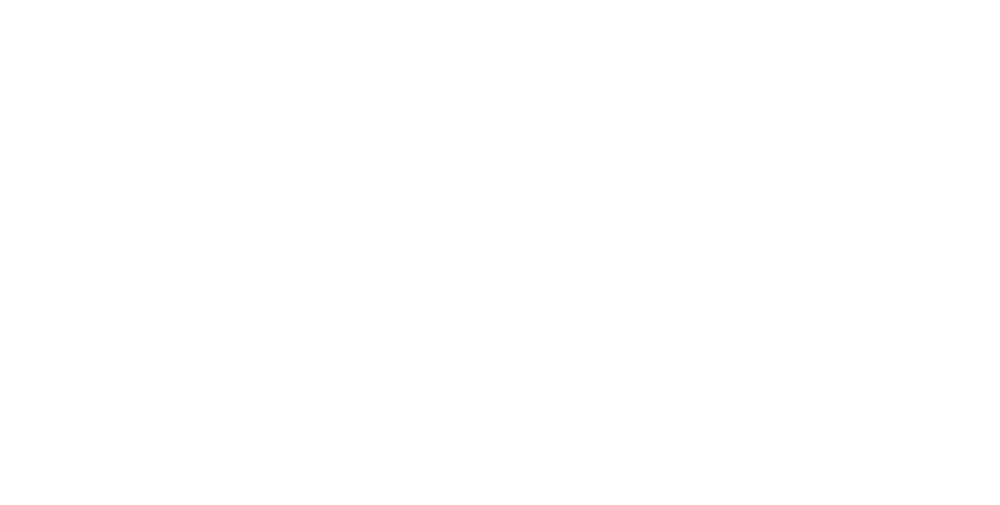

  
A Story in Every Cup

  
Travesia is the journey we share with those who dared to cross borders &mdash; geographic, emotional, and personal.

  <a href="#gathering" class="roots-link" data-en="The First Gathering &rarr;" data-es="El Primer Encuentro &rarr;">The First Gathering &rarr;</a>
</section>

<section class="river">
  
We were born from the desire to honor our roots and turn memory into a bridge between cultures.

</section>

<section class="film" id="film">
  The Film
  
The film that gave Travesia its first voice &mdash; recorded between Bucaramanga and New York.

  
<button class="film__play" data-track="VideoClick" aria-label="Play film"><svg width="22" height="22" viewBox="0 0 24 24" fill="currentColor"><path d="M8 5v14l11-7z"/></svg></button>

</section>

<section class="gathering" id="gathering">
  The First Gathering
  <h2 class="gathering__title" data-en="The First Gathering" data-es="El Primer Encuentro">The First Gathering</h2>
  
A private gathering in New York where Travesía shared its first chapter with people from different origins, memories, and journeys.

  

    <figure class="g-img g-main">
      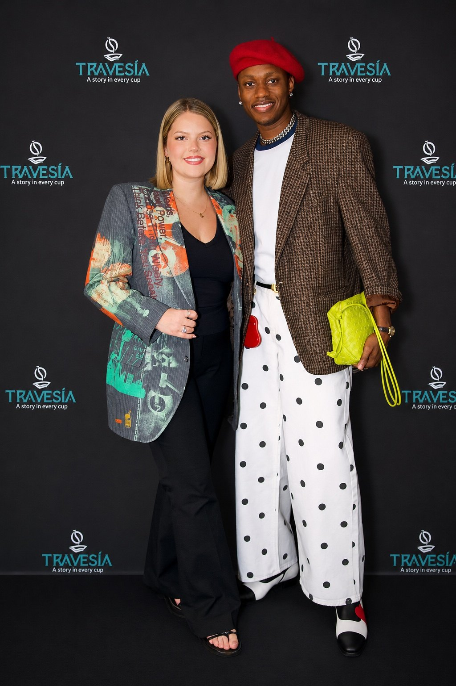
    </figure>
    <figure class="g-img g-side">
      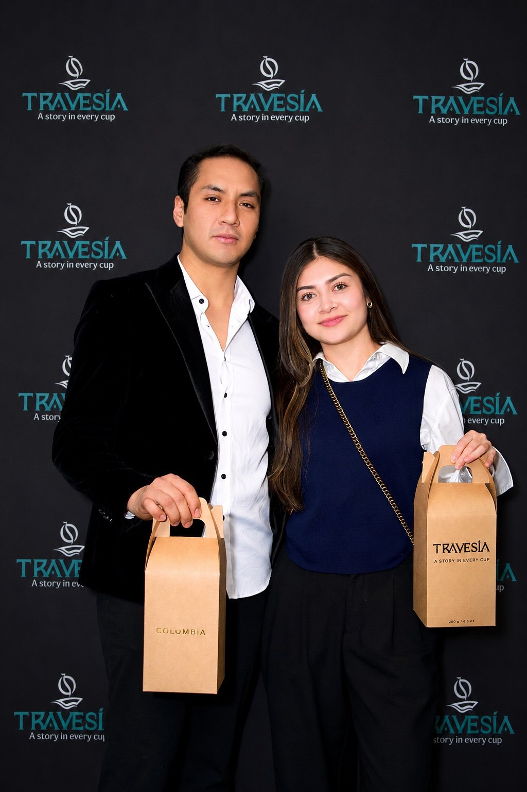
    </figure>
    <figure class="g-img g-side">
      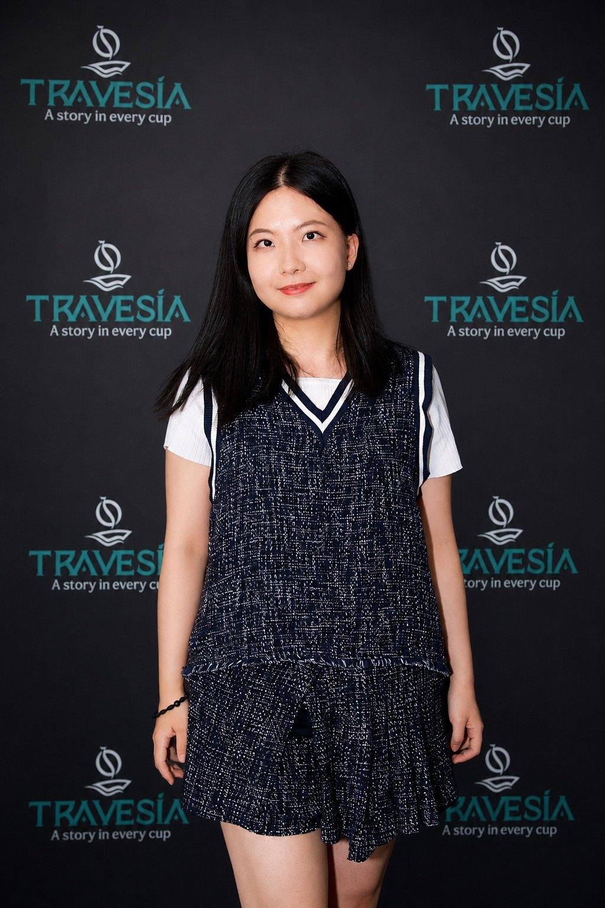
    </figure>
    <figure class="g-img g-side">
      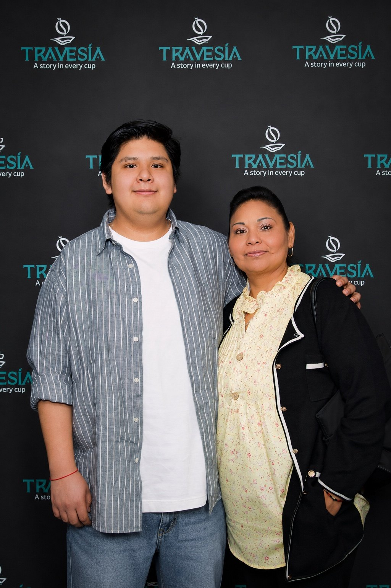
    </figure>
    <figure class="g-img g-side">
      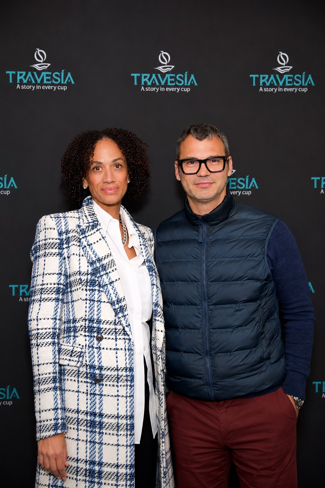
    </figure>
    <figure class="g-img g-side">
      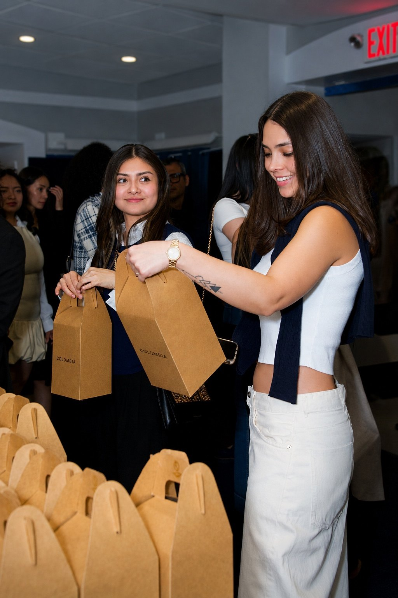
    </figure>
    <figure class="g-img g-side">
      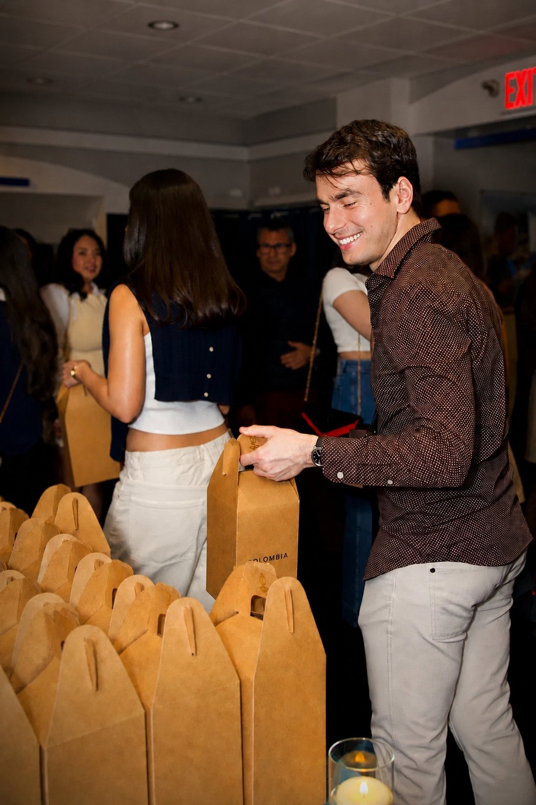
    </figure>
    <figure class="g-img g-side">
      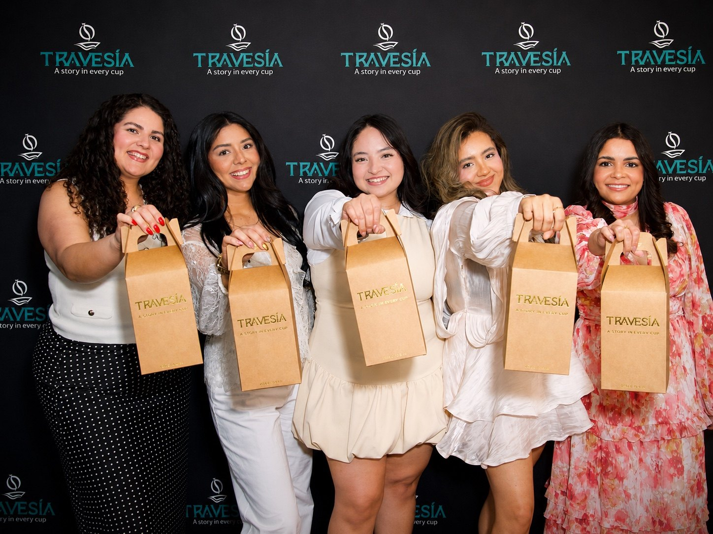
    </figure>
  

  
New York &middot; 2026

</section>

<!-- BOLSA MADE BY MOM -->
<section class="mom-section">
  

    

      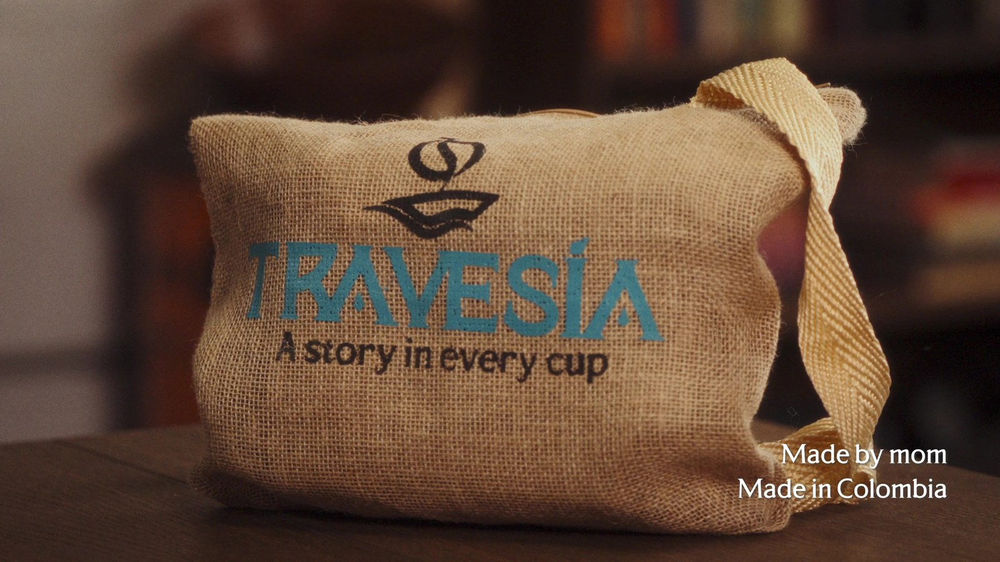
    

    

      Made by mom
      <h3 data-en="Made by mom. Made in Colombia." data-es="Hecho por mama. Hecho en Colombia.">Made by mom. Made in Colombia.</h3>
      
Every bag that arrives with your Raices was sewn by hand in Bucaramanga, Colombia. Not a factory. A family. Warmth you can feel before the first sip.

    

  

</section>

<section class="participants" id="participants">
  Many stories
  <h2 class="participants__title" data-en="Many stories. One cup." data-es="Muchas historias. Una taza.">Many stories. One cup.</h2>
  
Ten journeys. Ten origins. The first chapter of Travesia.

  

    <article class="person">
      

        
        
PZ

      

      
&#x1F1EB;&#x1F1F7;

      
Pierre Zorza

      
France

      
Part of Travesia's first chapter.

    </article>
    <article class="person">
      

        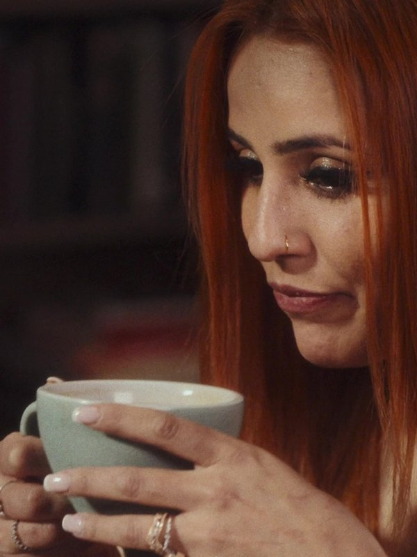
        
JS

      

      
&#x1F1E8;&#x1F1F4;

      
Juliana Salcedo

      
Colombia

      
Part of Travesia's first chapter.

    </article>
    <article class="person">
      

        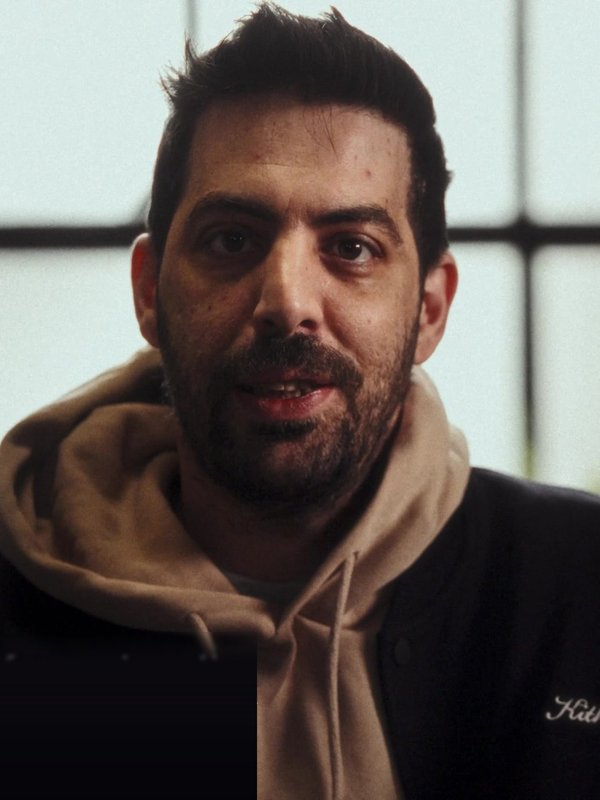
        
PM

      

      
&#x1F1EC;&#x1F1F7;

      
Panagiotis Monogioudis

      
Greece

      
Part of Travesia's first chapter.

    </article>
    <article class="person">
      

        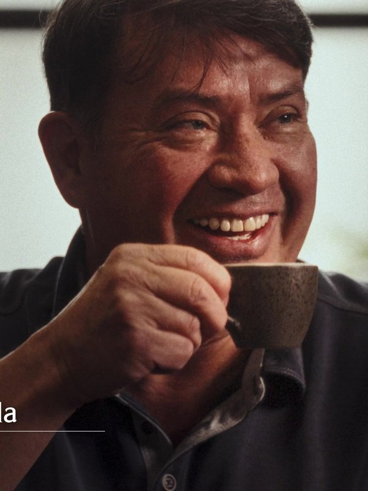
        
WP

      

      
&#x1F1E8;&#x1F1F4;

      
Wilson Pinilla

      
Colombia

      
Part of Travesia's first chapter.

    </article>
    <article class="person">
      

        
        
RM

      

      
&#x1F1E8;&#x1F1F3;

      
Ruoyu Ma

      
China

      
Part of Travesia's first chapter.

    </article>
    <article class="person">
      

        
        
AN

      

      
&#x1F1F2;&#x1F1FD;

      
Andrea Noriega

      
Mexico

      
Part of Travesia's first chapter.

    </article>
    <article class="person">
      

        
        
MR

      

      
&#x1F1FB;&#x1F1EA;

      
Maria Rojas

      
Venezuela

      
Part of Travesia's first chapter.

    </article>
    <article class="person">
      

        
        
EK

      

      
&#x1F1F7;&#x1F1FA;

      
Egor Klevtcov

      
Russia

      
Part of Travesia's first chapter.

    </article>
    <article class="person">
      

        
        
DS

      

      
&#x1F1E9;&#x1F1FF;

      
Djamal Salaouatchi

      
Algeria

      
Part of Travesia's first chapter.

    </article>
    <article class="person">
      

        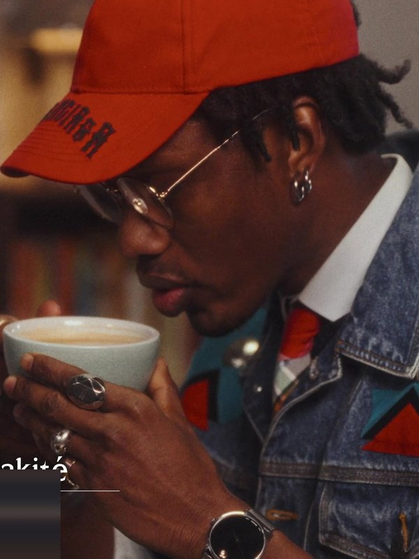
        
MD

      

      
&#x1F1F2;&#x1F1F1;

      
Massama Diakite

      
Mali

      
Part of Travesia's first chapter.

    </article>
  

</section>

<!-- CUP CLOSING -->
<section class="cup-close">
  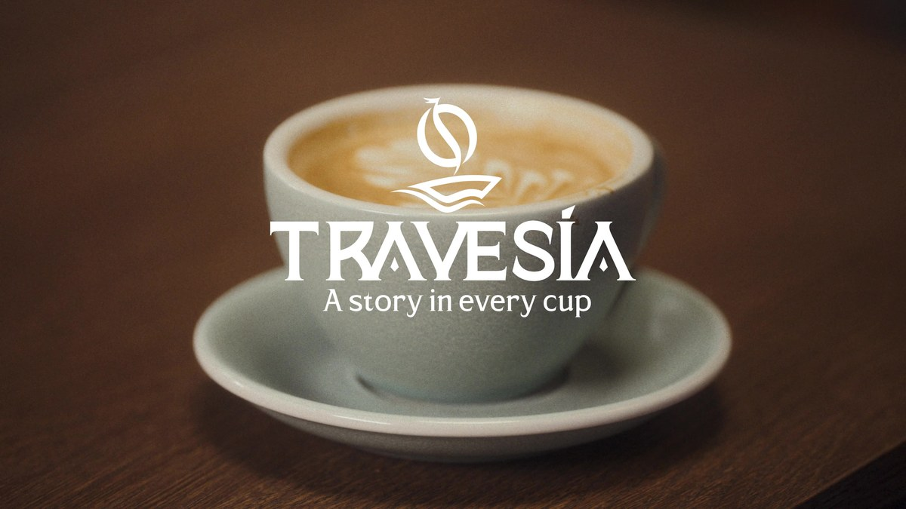
</section>

<section class="cta">
  <h2 data-en="Now it's your turn." data-es="Ahora es tu turno.">Now it's your turn.</h2>
  <a href="index.html#early-access" class="btn-primary cta-main" data-track="PreorderClick" data-ea-en="Join Early Access" data-ea-es="Unirme al Early Access" data-po-en="Preorder Raíces" data-po-es="Reservar Raíces">Join Early Access</a>
</section>

<footer class="footer">
  

    

A Story in Every Cup

Instagram &middot; Facebook &middot; Twitter

    
<h4>Travesia</h4><a href="index.html#raices">Raíces</a><a href="our-story.html" data-en="Our Story" data-es="Nuestra Historia">Our Story</a><a href="index.html#film">Film</a><a href="index.html#contact" data-en="Contact" data-es="Contacto">Contact</a>

    
<h4 data-en="Support / Legal" data-es="Soporte / Legal">Support / Legal</h4><a href="legal.html#privacy" data-en="Privacy Policy" data-es="Politica de Privacidad">Privacy Policy</a><a href="legal.html#cookies" data-en="Cookie Policy" data-es="Politica de Cookies">Cookie Policy</a><a href="legal.html#terms" data-en="Terms &amp; Conditions" data-es="Terminos y Condiciones">Terms &amp; Conditions</a><a href="legal.html#shipping" data-en="Shipping &amp; Returns" data-es="Envios y Devoluciones">Shipping &amp; Returns</a><a href="index.html#contact" data-en="Customer Service" data-es="Atencion al Cliente">Customer Service</a>

  

  
&copy; 2026 Travesia Colombian Corp. All rights reserved.

</footer>

</body>
</html>
<!DOCTYPE html>
<html lang="en">
<head>
<meta charset="UTF-8">
<meta name="viewport" content="width=device-width, initial-scale=1.0">
<title>Raíces — Travesía</title>
<meta name="description" content="Raíces — specialty Colombian coffee from Santander.">
<link rel="icon" type="image/png" href="assets/symbol-color.png">
<link rel="preconnect" href="https://fonts.googleapis.com">
<link rel="preconnect" href="https://fonts.gstatic.com" crossorigin>
<link href="https://fonts.googleapis.com/css2?family=Cormorant+Garamond:ital,wght@0,300;0,400;0,500;0,600;1,300;1,400;1,500&family=DM+Sans:wght@300;400;500&display=swap" rel="stylesheet">

</head>
<body>
<nav class="nav">
  <button class="burger" id="burger" aria-label="Open menu"></button>
  
  <ul class="nav__links">
    <li><a href="raices.html">Raíces</a></li>
    <li><a href="our-story.html" data-en="Our Story" data-es="Nuestra Historia">Our Story</a></li>
    <li><a href="index.html#film">Film</a></li>
    <li><a href="index.html#contact" data-en="Contact" data-es="Contacto">Contact</a></li>
  </ul>
  

    
<button data-lang="en" class="active">EN</button>/<button data-lang="es">ES</button>

    <a href="raices.html" aria-label="Raices"><svg class="cart" viewBox="0 0 24 24" fill="none" stroke="currentColor" stroke-width="1.4"><path d="M6 6h15l-1.5 9h-12z"/><circle cx="9" cy="20" r="1"/><circle cx="18" cy="20" r="1"/><path d="M6 6 5 3H2"/></svg></a>
  

</nav>

  <button class="mm-close" id="mmClose" aria-label="Close menu">&times;</button>
  <a href="raices.html">Raíces</a>
  <a href="our-story.html" data-en="Our Story" data-es="Nuestra Historia">Our Story</a>
  <a href="index.html#film">Film</a>
  <a href="index.html#contact" data-en="Contact" data-es="Contacto">Contact</a>
  
<button data-lang="en" class="active">EN</button>/<button data-lang="es">ES</button>

  
Instagram &middot; Facebook &middot; Twitter

<section class="product">
  

    

      

      

    

    

      First edition - Santander, Colombia
      <h1 class="info__title">Raíces</h1>
      
Raices is Travesia's first limited release — a specialty Colombian coffee from Santander, created as the first chapter of a journey between origin, memory, and New York.

      
Chocolate - Panela - Red fruits - Almond

      

        <h3 data-en="First Edition — Early Access" data-es="Primera Edicion — Early Access">First Edition — Early Access</h3>
        
Raices is not on sale yet. Join the priority list now to get early access to the official preorder. This is registration, not a purchase.

      

      <a href="index.html#early-access" class="btn-primary cta-main" data-track="PreorderClick" data-ea-en="Join Early Access" data-ea-es="Unirme al Early Access" data-po-en="Preorder Raíces" data-po-es="Reservar Raíces">Join Early Access</a>
      

        Raices — First Edition · $20.99
        Editorial Edition · $24.50 after first release
      

      
Raices is Travesia's first limited release — a specialty Colombian coffee from Santander.

      

        <h4 class="shipping-estimator__title" data-en="Estimate delivery time" data-es="Estimar tiempo de entrega">Estimate delivery time</h4>
        

          <input id="zipInput" type="text" inputmode="numeric" maxlength="5"
            data-en-ph="ZIP Code" data-es-ph="Codigo ZIP" placeholder="ZIP Code">
          <button id="zipCheck" data-en="Check" data-es="Verificar">Check</button>
        

        

        
Estimated UPS® Ground delivery from New York. Free shipping on orders $49+. Final shipping cost and delivery time are confirmed at checkout.

      

    

  

</section>

<!-- THE TRAVESIA EXPERIENCE -->
<section class="experience">
  

    The Travesia Experience
    
Before the first sip, pause for a moment. Hold the bag with both hands, bring it slowly to your nose, close your eyes, and breathe deeply. Let the aroma awaken your memories, your origin, and the moments that live within you.

    
Travesia &mdash; <em>A Story in Every Cup</em>

    
Each bag includes a vertical experience card with a sensory ritual on one side and preparation guidance on the other.

  

</section>

<section class="spec">
  

    <h2 data-en="Product details" data-es="Ficha tecnica">Product details</h2>
    <table>
      <tr><td class="field" data-en="Name" data-es="Nombre">Name</td><td class="value">Raices</td></tr>
      <tr><td class="field" data-en="Type" data-es="Tipo">Type</td><td class="value" data-en="Specialty Colombian Coffee" data-es="Cafe colombiano de especialidad">Specialty Colombian Coffee</td></tr>
      <tr><td class="field" data-en="Origin" data-es="Origen">Origin</td><td class="value">Santander, Colombia</td></tr>
      <tr><td class="field" data-en="Size" data-es="Tamano">Size</td><td class="value">250g / 8.8 oz</td></tr>
      <tr><td class="field" data-en="Process" data-es="Proceso">Process</td><td class="value" data-en="Washed" data-es="Lavado">Washed</td></tr>
      <tr><td class="field" data-en="Tasting notes" data-es="Notas de cata">Tasting notes</td><td class="value" data-en="Chocolate - Panela - Red fruits - Almond" data-es="Chocolate - Panela - Frutos rojos - Almendra">Chocolate - Panela - Red fruits - Almond</td></tr>
      <tr class="only-ea"><td class="field" data-en="Status" data-es="Estado">Status</td><td class="value" data-en="Early Access - preorder opening soon" data-es="Early Access - preventa proximamente">Early Access - preorder opening soon</td></tr>
      <tr class="only-po"><td class="field" data-en="Status" data-es="Estado">Status</td><td class="value" data-en="Preorder - limited to 300" data-es="Preventa - solo 300 unidades">Preorder - limited to 300</td></tr>
      <tr class="only-po"><td class="field" data-en="Preorder Price" data-es="Precio de preventa">Preorder Price</td><td class="value">$20.99</td></tr>
      <tr class="only-po"><td class="field" data-en="Regular Price" data-es="Precio regular">Regular Price</td><td class="value" data-en="$24.50 — Editorial Edition" data-es="$24.50 — Edicion Editorial">$24.50 — Editorial Edition</td></tr>
      <tr class="only-po"><td class="field" data-en="Shipping" data-es="Envio">Shipping</td><td class="value" data-en="Calculated at checkout" data-es="Calculado al finalizar la compra">Calculated at checkout</td></tr>
      <tr><td class="field" data-en="Support" data-es="Soporte">Support</td><td class="value">info@travesiacolombiancoffee.com</td></tr>
    </table>
  

</section>
<section class="faq">
  <h2 data-en="Frequently asked" data-es="Preguntas frecuentes">Frequently asked</h2>
  

Is Early Access a purchase?

No. Early Access is free registration for the priority list.

  

When will the preorder open?

Early Access members will be the first to know by email.

  

Does it come ground or whole bean?

Raices is available whole bean or ground. Select your preference at checkout.

  

How should I store it?

Store in a cool, dry place away from direct sunlight. Consume within 30 days of opening for best flavor. The resealable bag keeps freshness between uses.

  

What is preorder?

Preorder is early access to the first chapter of Travesia.

  

When will my order ship?

Orders are prepared after the preorder closes.

  

Can I cancel my preorder?

Preorder cancellations may be requested before the preorder period closes by contacting info@travesiacolombiancoffee.com.

  

What happens if the estimated date changes?

If the estimated date changes, Travesia will notify you by email.

  

Where do you ship?

During the first release, Travesia will ship within the United States.

  

How do I contact Travesia?

You can contact Travesia at info@travesiacolombiancoffee.com

</section>
<footer class="footer">
  

    

A Story in Every Cup

Instagram &middot; Facebook &middot; Twitter

    
<h4>Travesia</h4><a href="raices.html">Raíces</a><a href="our-story.html" data-en="Our Story" data-es="Nuestra Historia">Our Story</a><a href="index.html#film">Film</a><a href="index.html#contact" data-en="Contact" data-es="Contacto">Contact</a>

    
<h4 data-en="Support / Legal" data-es="Soporte / Legal">Support / Legal</h4><a href="legal.html#privacy" data-en="Privacy Policy" data-es="Politica de Privacidad">Privacy Policy</a><a href="legal.html#cookies" data-en="Cookie Policy" data-es="Politica de Cookies">Cookie Policy</a><a href="legal.html#terms" data-en="Terms &amp; Conditions" data-es="Terminos y Condiciones">Terms &amp; Conditions</a><a href="legal.html#shipping" data-en="Shipping &amp; Returns" data-es="Envios y Devoluciones">Shipping &amp; Returns</a><a href="index.html#contact" data-en="Customer Service" data-es="Atencion al Cliente">Customer Service</a>

  

  
&copy; 2026 Travesia Colombian Corp. All rights reserved.

</footer>

</body>
</html>
